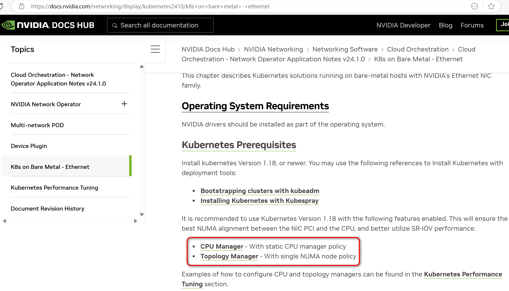

# pthread-setaffinity

英伟达官方[文档](https://docs.nvidia.com/networking/display/kubernetes2410/k8s+on+bare+metal+-+ethernet)，建议打开。



https://github.com/microsoft/onnxruntime

会取 online cpu，把宿主机的都取到了，然后绑核，但是会报警告，因为容器通过 cgroup cpu set 特性，已经限制了容器只能使用特定核。

```bash
docker run --rm -ti --name builder -v $(pwd):/root/pthread-setaffinity \
-w /root/pthread-setaffinity --entrypoint clang \
envoyproxy/envoy-build-centos:75238004b0fcfd8a7f71d380d7a774dda5c39622 \
-DCOMMIT_ID="\"$(git rev-parse HEAD)\"" \
-D_GNU_SOURCE -D__USE_GNU -O0 -g -std=gnu99 -fPIC -Iinclude -shared \
-Wl,-soname,libpthread-setaffinity.so -ldl -o bin/libpthread-setaffinity.so \
src/pthread-setaffinity.c src/cpuset.c

echo /opt/westcloud/libpthread-setaffinity.so > /etc/ld.so.preload
```

## [C++版本](https://github.com/tedli/pthread-setaffinity/tree/c++17)
